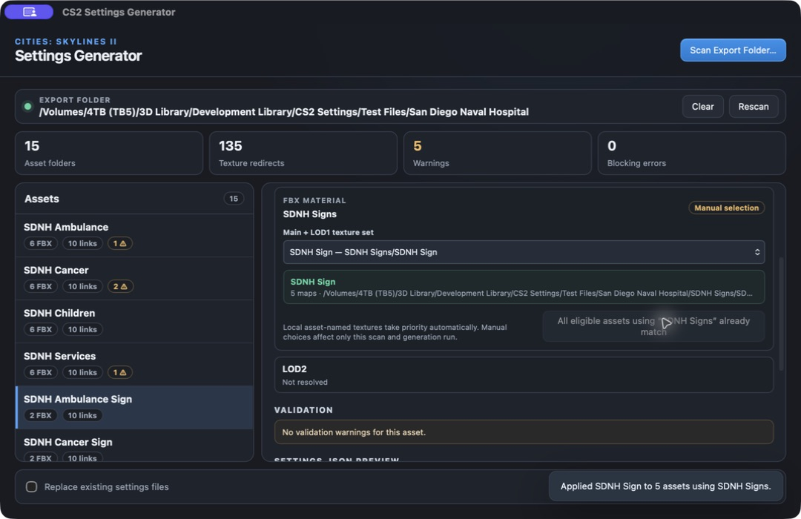

# CS2 Settings Generator User Guide

<p align="center">
  
</p>

CS2 Settings Generator scans a complete Cities: Skylines II asset export,
checks its FBX and texture relationships, and creates the `settings.json` files
needed when assets share textures.

The app never edits FBX files or textures. Existing `settings.json` files are
preserved unless you explicitly enable replacement.

## Download and install

Download the newest version from the
[GitHub Releases page](https://github.com/Macwelshman/CS2-Settings-Generator/releases/latest).

### macOS

1. Download the Apple Silicon `.dmg` file.
2. Open the disk image and drag **CS2 Settings Generator** to Applications.
3. Open the app from Applications.

The current build is ad-hoc signed rather than notarized. If macOS blocks the
first launch, Control-click the app, choose **Open**, then confirm **Open**.

### Windows

1. Download the x64 setup `.exe` for a normal installation.
2. Run the installer and follow its prompts.
3. Open **CS2 Settings Generator** from the Start menu.

An `.msi` installer is also supplied for managed deployment. The Windows build
is currently unsigned, so Windows may display a security warning during the
first installation.

## Prepare the export folder

Place the asset folders you want to process beneath one overall export folder.
The app scans that folder recursively, so shared textures can sit in a separate
asset folder from the FBX files that use them.

```text
My Export/
├── Main Building/
│   ├── Main Building.fbx
│   ├── Main Building_LOD1.fbx
│   └── Main Building_LOD2.fbx
├── Building Textures/
│   ├── Building Textures_BaseColor.png
│   ├── Building Textures_MaskMap.png
│   └── Building Textures_Normal.png
└── Signs/
    ├── Sign A/
    │   ├── Sign A.fbx
    │   └── Sign A_LOD1.fbx
    └── Shared Sign Textures/
        ├── Shared Sign Textures_BaseColor.png
        ├── Shared Sign Textures_MaskMap.png
        └── Shared Sign Textures_Normal.png
```

## Scan an export

1. Open CS2 Settings Generator.
2. Drag the overall export folder into the window, or select
   **Scan Export Folder…**.
3. Wait for the recursive scan to finish.
4. Review the summary for asset folders, texture redirects, warnings, and
   blocking errors.



Select an asset in the left column to inspect:

- its detected FBX variants and material names;
- the texture set used by the main mesh and LOD1;
- the independently detected LOD2 texture set;
- validation warnings or errors;
- the proposed `settings.json` content.

## How texture sets are resolved

The scanner follows these rules:

- Textures already stored beside an asset under its own required name are
  local and take priority.
- LOD1 always uses the same texture set as the main mesh.
- LOD2 can use a separate LOD2 texture set.
- If textures are stored elsewhere, the generated JSON uses a portable
  relative path with `/` separators.
- Missing texture destinations are never written to the generated file.

Common supported maps include `BaseColor`, `ControlMask`, `MaskMap`, `Normal`,
`Emissive`, and indexed emissive maps.

## Choose a texture set manually

Use the **Main + LOD1 texture set** menu when automatic detection cannot decide
between multiple texture providers, or when differently named assets share a
material and texture set.

1. Select the affected asset.
2. Open **Main + LOD1 texture set**.
3. Choose the correct named texture set.
4. If other non-local assets use the same FBX material, use **Apply to other
   assets using…** to assign the choice to them together.
5. Check that the blocking-error count returns to zero.

Local asset-named textures are protected and are not replaced by a
material-wide assignment. Manual selections last for the current scan and
generation run.

## Understand validation results

Warnings identify files that should be reviewed but do not always prevent
generation. Blocking errors prevent the affected asset from being generated
until its texture relationship can be resolved safely.

The app checks that:

- main and LOD1 FBX files have one material;
- LOD2 and shader sub-meshes such as `_Win`, `_Wim`, `_Gls`, `_Gra`, and `_Wat`
  have no material;
- texture filenames and recognised suffixes are valid;
- every proposed shared-texture destination exists;
- ambiguous texture providers are not guessed silently.

## Generate settings files

1. Resolve any blocking errors.
2. Review the `settings.json` preview for representative assets.
3. Leave **Replace existing settings files** disabled to preserve existing
   files, or enable it only when you intend to overwrite them.
4. Select **Generate Settings Files**.
5. Read the completion message for generated, replaced, preserved, unresolved,
   or failed files.

Each generated file is written inside its asset folder:

```json
{
  "sharedAssets": {
    "Sign A_BaseColor.png": "../Shared Sign Textures/Shared Sign Textures_BaseColor.png",
    "Sign A_LOD1_BaseColor.png": "../Shared Sign Textures/Shared Sign Textures_BaseColor.png"
  }
}
```

## Clear, rescan, and replacement safety

- **Rescan** reads the same export folder again and keeps applicable manual
  selections.
- **Clear** returns to the opening screen without deleting or modifying source
  files.
- Choosing a different export folder starts a new scan and clears previous
  manual selections.
- Existing settings files are skipped unless replacement is explicitly enabled.

## Troubleshooting

### Textures could not be resolved

Select the asset and choose the intended **Main + LOD1 texture set**. If several
assets use the same FBX material, apply that choice to the other eligible
assets.

### A special sub-mesh reports a material warning

Remove the material from shader sub-mesh FBX files such as `_Win`. These meshes
should not contain materials.

### Existing settings files were preserved

This is the safe default. Enable **Replace existing settings files** only after
reviewing the preview and deciding that the existing files should be replaced.

### The Generate button is unavailable

At least one scanned asset must be ready. Select assets showing errors, resolve
their texture sources, and review any invalid FBX or filename warnings.
