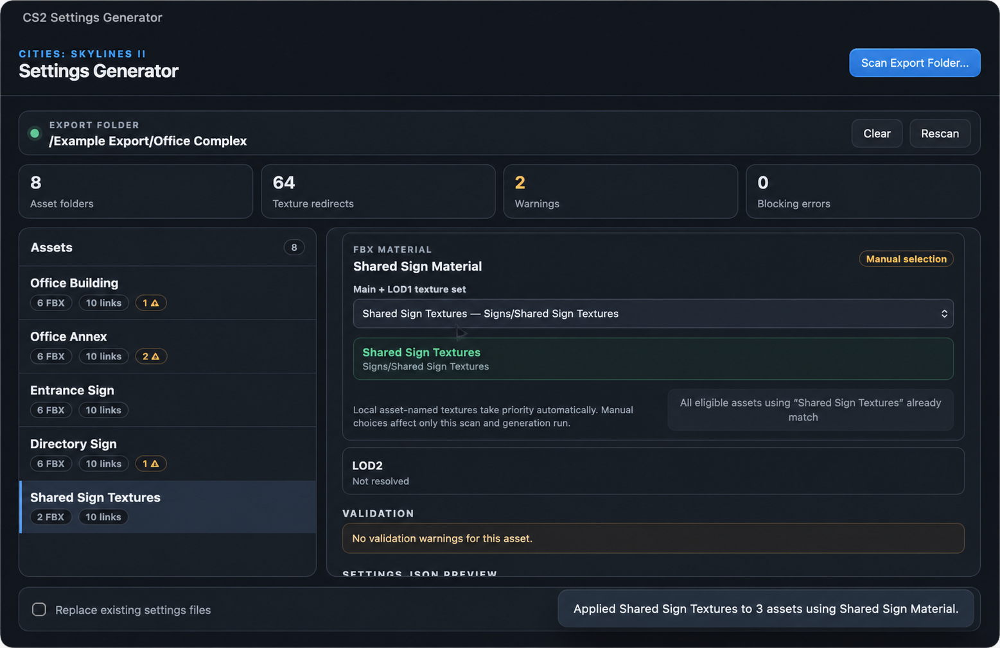
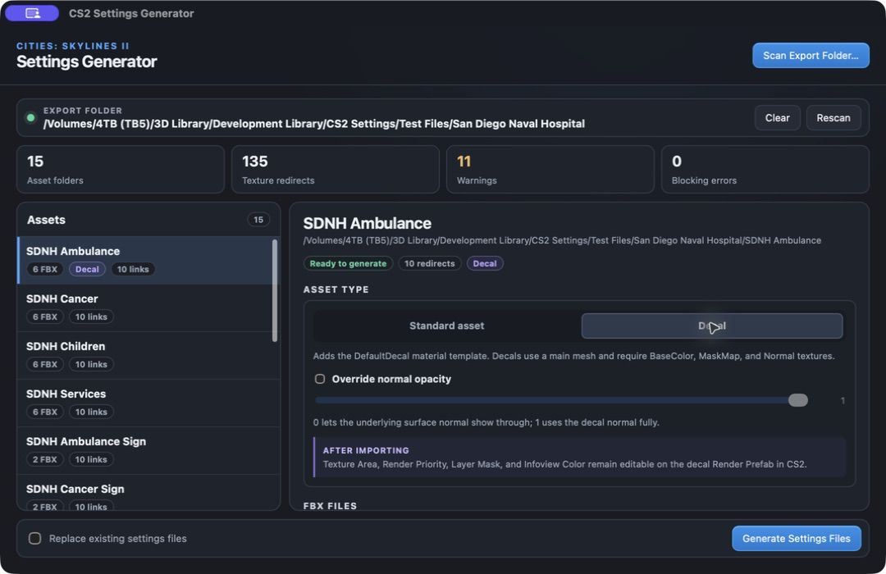

# CS2 Settings Generator User Guide

<p align="center">
  
</p>

CS2 Settings Generator scans a complete Cities: Skylines II asset export,
checks its FBX and texture relationships, and creates the `settings.json` files
needed when assets share textures. It can also add the import settings required
for decal assets.

The app never edits FBX files or textures. Existing `settings.json` files are
preserved unless you explicitly enable replacement.

## Download and install

Download the newest version from the
[GitHub Releases page](https://github.com/Macwelshman/CS2-Settings-Generator/releases/latest).

**Development-build note:** the decal and updater features described below
have not yet been published as a new release. The Windows x64 test build from
commit `1c597cb` was reported working in UTM. It still shows **0.1.3**, but is
different from the older published 0.1.3 installer. Its installers are in the
`CS2-Settings-Generator-Windows` artifact on the
[Windows build page](https://github.com/Macwelshman/CS2-Settings-Generator/actions/runs/33795645383).
Downloading an artifact may require GitHub sign-in.

### macOS

1. Download the Apple Silicon `.dmg` file.
2. Open the disk image and drag **CS2 Settings Generator** to Applications.
3. Open the app from Applications.

The current build is ad-hoc signed rather than notarized. If macOS blocks the
first launch, Control-click the app, choose **Open**, then confirm **Open**.

### Windows

1. Download the x64 setup `.exe` for a normal installation.
2. Run the installer and follow its prompts.
3. Open **CS2 Settings Generator** from the Start menu.

An `.msi` installer is also supplied for managed deployment. The Windows build
is currently unsigned, so Windows may display a security warning during the
first installation.

For a workflow test build, extract the downloaded artifact first, then run the
`x64-setup.exe` inside it. Use the setup installer for initial installation;
the separate `windows-x64.zip` is primarily the in-app update package. Close
any running copy before manually installing a test build.

## Prepare the export folder

Place the asset folders you want to process beneath one overall export folder.
The app scans that folder recursively, so shared textures can sit in a separate
asset folder from the FBX files that use them.

```text
My Export/
├── Main Building/
│   ├── Main Building.fbx
│   ├── Main Building_LOD1.fbx
│   └── Main Building_LOD2.fbx
├── Building Textures/
│   ├── Building Textures_BaseColor.png
│   ├── Building Textures_MaskMap.png
│   └── Building Textures_Normal.png
├── Signs/
│   ├── Sign A/
│   │   ├── Sign A.fbx
│   │   └── Sign A_LOD1.fbx
│   └── Shared Sign Textures/
│       ├── Shared Sign Textures_BaseColor.png
│       ├── Shared Sign Textures_MaskMap.png
│       └── Shared Sign Textures_Normal.png
└── Decals/
    └── Courtyard Marking/
        ├── Courtyard Marking.fbx
        ├── Courtyard Marking_BaseColor.png
        ├── Courtyard Marking_MaskMap.png
        └── Courtyard Marking_Normal.png
```

## Scan an export

1. Open CS2 Settings Generator.
2. Drag the overall export folder into the window, or select
   **Scan Export Folder…**.
3. Wait for the recursive scan to finish.
4. Review the summary for asset folders, texture redirects, warnings, and
   blocking errors.

<p align="center">
  
</p>

Select an asset in the left column to inspect:

- its detected FBX variants and material names;
- the texture set used by the main mesh and LOD1;
- the independently detected LOD2 texture set;
- validation warnings or errors;
- the proposed `settings.json` content.

## Choose the asset type

Every detected asset initially uses **Standard asset**. This keeps the existing
mesh and LOD texture-sharing behaviour unchanged.

If the selected files are for a decal:

1. Select the asset in the left column.
2. Under **Asset type**, choose **Decal**.
3. Check the automatically detected **Decal texture set**, or choose a shared
   texture set manually.
4. Resolve any missing BaseColor, MaskMap, or Normal errors.
5. Review the combined `settings.json` preview.

<p align="center">
  
</p>

The choice applies only to that asset, so standard assets and decals can be
processed together in one overall export-folder scan. Decals do not require an
LOD1 or LOD2 mesh, and the app does not show the standard missing-LOD1 warning
for them.

Selecting **Decal** adds the required `DefaultDecal` material template. Enable
**Override normal opacity** only when you want to write `_NormalOpacity` into
the settings file. A value of `0` lets the underlying surface normal show
through; `1` uses the decal normal fully.

Texture Area, Render Priority, Layer Mask, and Infoview Color are configured on
the decal Render Prefab after importing into CS2. They are not written by this
app.

## How texture sets are resolved

The scanner follows these rules:

- Textures already stored beside an asset under its own required name are
  local and take priority.
- LOD1 always uses the same texture set as the main mesh.
- LOD2 can use a separate LOD2 texture set.
- If textures are stored elsewhere, the generated JSON uses a portable
  relative path with `/` separators.
- Missing texture destinations are never written to the generated file.

Common supported maps include `BaseColor`, `ControlMask`, `MaskMap`, `Normal`,
`Emissive`, and indexed emissive maps.

## Choose a texture set manually

Use the **Main + LOD1 texture set** menu—or **Decal texture set** for a selected
decal—when automatic detection cannot decide between multiple texture
providers, or when differently named assets share a material and texture set.

1. Select the affected asset.
2. Open **Main + LOD1 texture set**.
3. Choose the correct named texture set.
4. If other non-local assets use the same FBX material, use **Apply to other
   assets using…** to assign the choice to them together.
5. Check that the blocking-error count returns to zero.

Local asset-named textures are protected and are not replaced by a
material-wide assignment. Manual selections last for the current scan and
generation run.

## Understand validation results

Warnings identify files that should be reviewed but do not always prevent
generation. Blocking errors prevent the affected asset from being generated
until its texture relationship can be resolved safely.

The app checks that:

- each FBX contains one mesh object whose name matches the FBX filename;
- texture filenames and recognised suffixes are valid;
- every proposed shared-texture destination exists;
- ambiguous texture providers are not guessed silently.

For decals, the app additionally requires BaseColor, MaskMap, and Normal in the
selected texture set. ControlMask and Emissive remain optional.

## Generate settings files

1. Resolve any blocking errors.
2. Review the `settings.json` preview for representative assets.
3. Leave **Replace existing settings files** disabled to preserve existing
   files, or enable it only when you intend to overwrite them.
4. Select **Generate Settings Files**.
5. Read the completion message for generated, replaced, preserved, unresolved,
   or failed files.

Each generated file is written inside its asset folder:

```json
{
  "sharedAssets": {
    "Sign A_BaseColor.png": "../Shared Sign Textures/Shared Sign Textures_BaseColor.png",
    "Sign A_LOD1_BaseColor.png": "../Shared Sign Textures/Shared Sign Textures_BaseColor.png"
  }
}
```

For a decal using shared textures, both kinds of information are kept in that
same file:

```json
{
  "SurfacePostProcessor": {
    "materialTemplate": "DefaultDecal",
    "floatProperties": {
      "_NormalOpacity": 0
    }
  },
  "sharedAssets": {
    "Courtyard Marking_BaseColor.png": "../Shared Decal Textures/Courtyard_BaseColor.png",
    "Courtyard Marking_MaskMap.png": "../Shared Decal Textures/Courtyard_MaskMap.png",
    "Courtyard Marking_Normal.png": "../Shared Decal Textures/Courtyard_Normal.png"
  }
}
```

If normal opacity is not overridden, the `floatProperties` block is omitted.
If textures already have the correct local names, `sharedAssets` can be empty
while the decal import settings are still generated.

## Clear, rescan, and replacement safety

- **Rescan** reads the same export folder again and keeps applicable manual
  selections.
- **Clear** returns to the opening screen without deleting or modifying source
  files.
- Choosing a different export folder starts a new scan and clears previous
  manual selections.
- Existing settings files are skipped unless replacement is explicitly enabled.

## Troubleshooting

### Textures could not be resolved

Select the asset and choose the intended **Main + LOD1 texture set**. If several
assets use the same FBX material, apply that choice to the other eligible
assets.

### An FBX reports a mesh object name warning

In your 3D software, rename the mesh object to exactly match the FBX filename
without the `.fbx` extension, then export the FBX again. For example,
`Station_LOD1.fbx` must contain one mesh object named `Station_LOD1`.

### A decal reports missing required textures

Confirm that the selected **Decal texture set** contains matching PNG files for
BaseColor, MaskMap, and Normal. If those textures live in another asset folder,
choose that shared set from the menu; the app will add portable relative paths
to the same decal `settings.json`.

### Existing settings files were preserved

This is the safe default. Enable **Replace existing settings files** only after
reviewing the preview and deciding that the existing files should be replaced.

### The Generate button is unavailable

At least one scanned asset must be ready. Select assets showing errors, resolve
their texture sources, and review any invalid FBX or filename warnings.

## Software updates

The app checks for a newer stable version when it opens. You can also select **Check for Updates…** in the toolbar (or the application menu on Mac).

When an update is available, select **Update Now** to download, verify and install it, **View Release** to read the release page, or **Later** to dismiss the notice for this session. Updating restarts the app: finish generating any pending settings first. Your export files are not changed by the updater.

If the release has no compatible update package, use **View Release** to download its normal installer. Install the app in a writable location; Mac users should move it out of the downloaded disk image before updating.

Older versions without this utility need one manual installation of the first updater-enabled release. See [Software update packaging and recovery](SOFTWARE_UPDATES.md) for maintainer details.

### What to expect

1. Finish generating any pending settings files.
2. Select **Check for Updates…**. If there is no newer stable release, the app
   reports that you are up to date.
3. If an update is offered, select **View Release** to review it, or **Update
   Now** and confirm the restart.
4. The app downloads and verifies the package before closing. After a
   successful replacement it reopens; scan your export folder again.

**Later** dismisses the notice for this session. Automatic network-check
failures are quiet; a manual check displays the error.

### An update cannot be installed

- If no matching package or valid checksum is available, use **View Release**
  to find a normal installer. The app will not install an unverified download.
- If the installation folder is not writable, move the Mac app to a writable
  folder, or use the Windows installer to update an administrator-managed
  installation. The updater does not request administrator privileges.
- If downloading or verification fails, the current installation stays in
  place. Retry later or use the release installer.
- If replacement fails, the helper attempts to restore the previous app and
  displays an error. If restoration also fails, keep the backup named in the
  message and follow the [recovery notes](SOFTWARE_UPDATES.md#replacement-and-recovery).

The successful UTM test confirms the test build was reported working; it does
not establish that a complete upgrade to a newer release has been tested.
